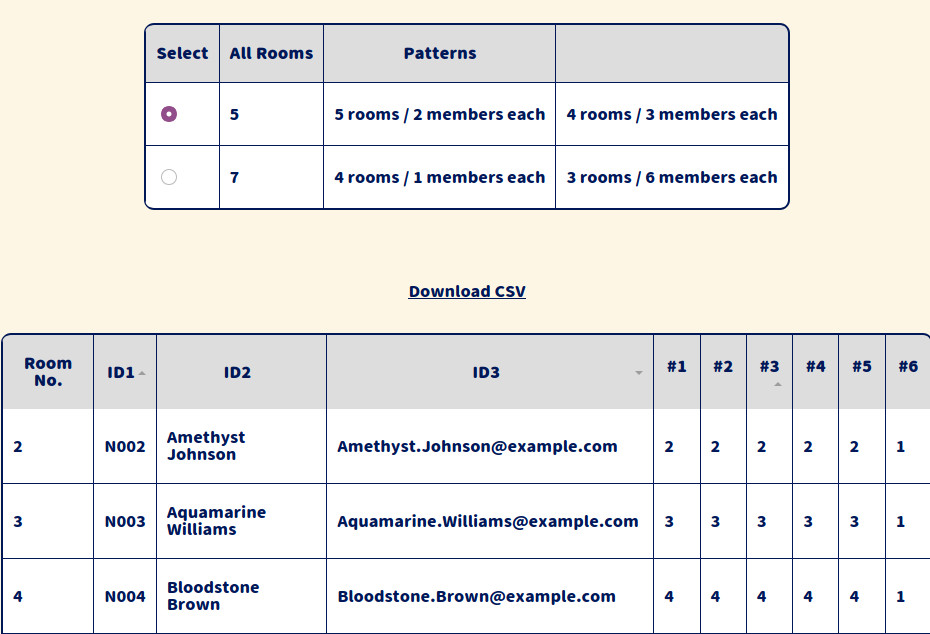

# COWAKÉ

## English ver
https://yoshikai.net/cowake/en

COWAKÉ is an application that generates the number of rooms, the number of people assigned, and the combination table so that members will never meet with the same person again, when you divide the participants into several rooms (groups) and have several breakout sessions.

### How to use it

* Enter the minimum number of people for one group and then enter the number of participants or the actual participant list to see the total number of rooms and the number of people per room.
* Once you enter the actual attendee list and choose the total number of rooms, it will assign members to each of the first room numbers and then show you the room numbers to move to the second and third times.
* Only in the last round, members will not be assigned to all the rooms, but to the same number of rooms as the maximum number of people per room up to that point. Depending on the number of people in the room, there will be only one room, but that person has already met all of them by then.
* Click on the heading of the assignment table to sort the data in ascending or descending order.
* You can enter up to three columns of data, separated by tabs, and you can copy and paste them directly from Excel, etc. The first column is basically in ascending order; the first column is for personal IDs, the second is for names, and the third is good for pseudonyms, emails, etc.

### Disclaimers, etc.
* Since this application does not leave any input information on the server, it does not collect any personal information.
* There is no output in CSV format, so please copy and paste the relevant range.
* Use the application at your own risk. We are not responsible for any damage caused by this application.
* Send your comments to takuto.yoshikai@gmail.com

## 日本語版

https://yoshikai.net/cowake/

COWAKÉ（こわけ）は、参加者をいくつかの部屋（グループ）に分けて何回かブレイクアウトセッションをするようなとき、同じ人と二度と会わないような部屋数・割り当て人数・組み合わせ表を生成するアプリケーションです。

### 使い方
* １グループの最小人数を入力し、参加者数または実際の参加者リストを入れると、総部屋数と部屋ごとの人数を表示します。
* 実際の参加者リストを入れ、総部屋数を選ぶと、メンバーを初回の部屋番号ごとに割り振り、その後２回目、３回目に移動する部屋番号を示します。
* 最後の回だけはすべての部屋に割り振るのではなく、それまでの一部屋あたりの人数の最大値と同じ部屋数に割り振ります。人数によって１人だけの部屋がでてきますが、その人はすでにそれまでに全員と会っています。
* 割り当て表の見出しをクリックすると、昇順・降順に並び替えます。
* 入力するデータはタブ区切りで３列まで入力できます。Excelなどでコピーしてそのまま貼り付けてください。１列目は基本的に昇順に並べられます。１列目は個人ID、２列目は氏名、３列目はふりがなや電子メールなどに使うといいでしょう。

### 免責事項など
* このアプリケーションはサーバーに入力情報を残さない仕組みであるため、個人情報は一切取得しません。
* CSV形式での出力などは用意していませんので、該当範囲をコピー＆ペーストなどしてお使いください。
* ご利用者の責任においてご利用ください。本アプリケーションによって損害が発生したとしても、製作者は一切責任を負いません。
* ご意見・ご感想は takuto.yoshikai@gmail.com までどうぞ

